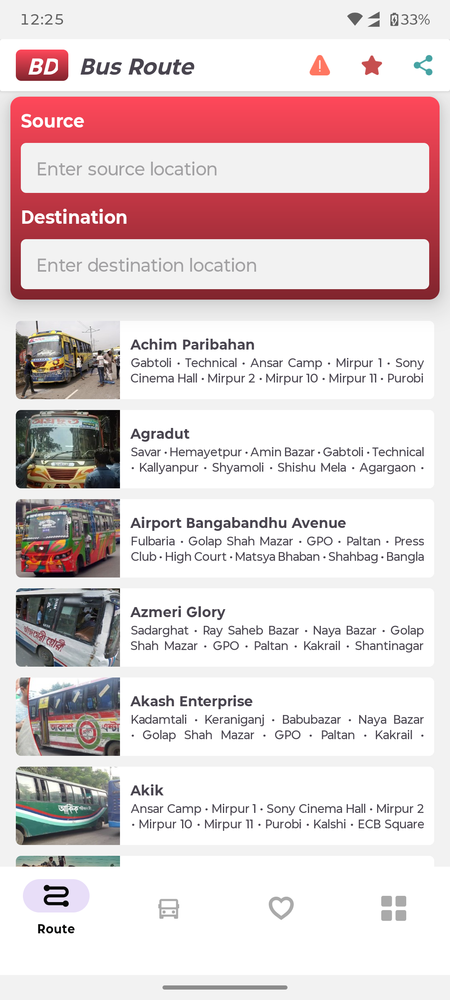
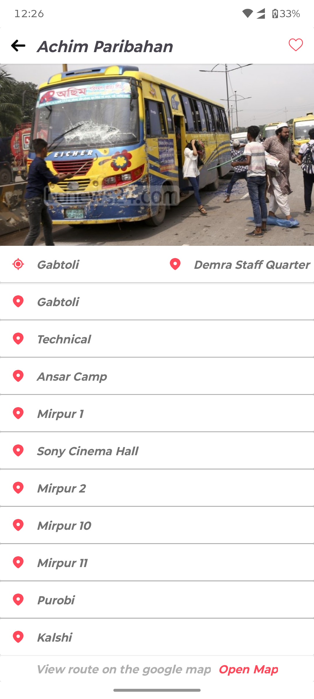

# BD Bus Route

An Android app to find all the bus names and routes in Dhaka city.

<p align="center">
  
  &nbsp;&nbsp;&nbsp;
  
</p>

## Features

- 🚌 Browse all 156 Dhaka city local buses
- 🔍 Search by bus name
- 🗺️ Find routes between two stops
- 🖼️ Bus images loaded from local assets (no internet required)
- ❤️ Save favourite buses
- 📍 Open route on Google Maps

## Data Source

- Bus route data: [dhaka-city-local-bus-json-data](https://github.com/imamhossain94/dhaka-city-local-bus-json-data)
- Bus images: Sourced from [Poribohon-BD](https://data.mendeley.com/datasets/pwyyg8zmk5/1), Google, and Facebook

## Screenshots

| Bus List | Bus Details |
|----------|-------------|
|  |  |

## Tech Stack

- **Language:** Kotlin
- **Min SDK:** 26 (Android 8.0)
- **Target SDK:** 34 (Android 14)
- **Image Loading:** Glide
- **Data Storage:** Hawk (SharedPreferences wrapper)
- **JSON Parsing:** Gson

## Dependencies

```gradle
implementation("de.hdodenhof:circleimageview:3.1.0")
implementation("com.github.bumptech.glide:glide:4.12.0")
implementation("com.google.code.gson:gson:2.8.8")
implementation("com.orhanobut:hawk:2.0.1")
implementation("com.jsibbold:zoomage:1.3.1")
implementation("androidx.core:core-splashscreen:1.0.1")
```

## Build & Install

### Requirements
- Android Studio (Hedgehog or newer)
- JDK 17+
- Android SDK (API 26+)
- ADB (for device install)

### Build Debug APK

```bash
# Set JAVA_HOME to your JDK (Android Studio's JBR recommended)
export JAVA_HOME="<path-to-android-studio>/jbr"

# Build
./gradlew assembleDebug
```

### Install on Device

```bash
# Connect device via USB with USB Debugging enabled
adb install app/build/outputs/apk/debug/app-debug.apk
```

Or open the project in Android Studio and click **Run ▶**.

## Data Model

```kotlin
data class BusData(
    @SerializedName("english") val english: String,
    @SerializedName("bangle") val bangle: String,
    @SerializedName("image") val image: String,
    @SerializedName("routes") val routes: List<String>,
    @SerializedName("time") val time: String,
    @SerializedName("service_type") val serviceType: String
)
```

## Privacy & Licensing

- Bus images are stored locally in `app/src/main/assets/buses-image/`
- No Firebase or remote storage dependency for images
- No personal data collected

## Developer

**Md. Imam Hossain**  
Icons from [svgrepo.com](https://www.svgrepo.com/)
