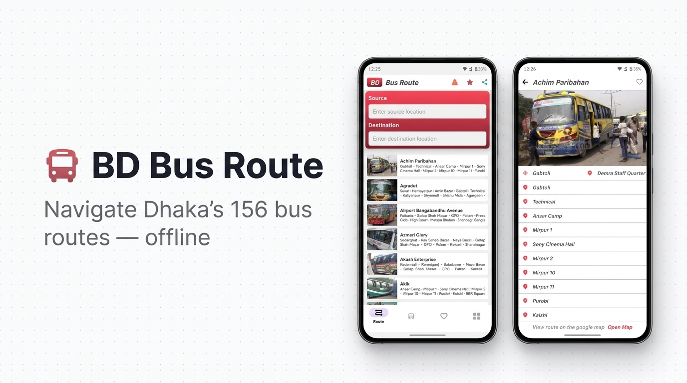

<p align="center">
  
</p>

<p align="center">
  <a href="https://github.com/imamhossain94/BdBusRoute/releases">
    
  </a>
  
  
  
</p>

<p align="center">
  <b>🚌 Find all bus names and routes across Dhaka city — offline, fast, and free.</b>
</p>

---

## ✨ Features

| Feature | Description |
|---------|-------------|
| 🚌 **156 Buses** | Complete list of Dhaka city local buses |
| 🔍 **Smart Search** | Search by bus name instantly |
| 🗺️ **Route Finder** | Find all buses running between two stops |
| ❤️ **Favourites** | Save your frequently used bus routes |
| 📍 **Google Maps** | Open any route directly in Google Maps |
| 📦 **Fully Offline** | Bus images loaded from local assets — no internet needed |


## 🛠️ Tech Stack

| Layer | Technology |
|-------|------------|
| **Language** | Kotlin |
| **Min SDK** | API 26 (Android 8.0 Oreo) |
| **Target SDK** | API 34 (Android 14) |
| **Image Loading** | [Glide](https://github.com/bumptech/glide) 4.12 |
| **Preferences** | [Hawk](https://github.com/orhanobut/hawk) 2.0 |
| **JSON Parsing** | [Gson](https://github.com/google/gson) 2.8.8 |
| **Zoomable Image** | [Zoomage](https://github.com/jsibbold/zoomage) 1.3.1 |
| **Splash Screen** | AndroidX Core SplashScreen 1.0.1 |

---

## 📦 Dependencies

```gradle
implementation("de.hdodenhof:circleimageview:3.1.0")
implementation("com.github.bumptech.glide:glide:4.12.0")
implementation("com.google.code.gson:gson:2.8.8")
implementation("com.orhanobut:hawk:2.0.1")
implementation("com.jsibbold:zoomage:1.3.1")
implementation("androidx.core:core-splashscreen:1.0.1")
```

---

## 🚀 Build & Install

### Requirements

- **Android Studio** Hedgehog or newer
- **JDK** 17+
- **Android SDK** API 26+
- **ADB** (for device install via command line)

### Build Debug APK

```bash
# (Optional) Set JAVA_HOME to Android Studio's JBR
export JAVA_HOME="<path-to-android-studio>/jbr"

# Build debug APK
./gradlew assembleDebug
```

### Install on Device

```bash
# Connect device via USB with USB Debugging enabled
adb install app/build/outputs/apk/debug/app-debug.apk
```

> **Or:** Open the project in Android Studio and click **Run ▶**

---

## 🗂️ Data Model

```kotlin
data class BusData(
    @SerializedName("english")      val english: String,
    @SerializedName("bangle")       val bangle: String,
    @SerializedName("image")        val image: String,
    @SerializedName("routes")       val routes: List<String>,
    @SerializedName("time")         val time: String,
    @SerializedName("service_type") val serviceType: String
)
```

---

## 📊 Data Sources

- **Bus route data** → [dhaka-city-local-bus-json-data](https://github.com/imamhossain94/dhaka-city-local-bus-json-data)
- **Bus images** → Sourced from [Poribohon-BD (Mendeley)](https://data.mendeley.com/datasets/pwyyg8zmk5/1), Google, and Facebook

---

## 🔒 Privacy

- All bus images are bundled locally in `app/src/main/assets/buses-image/`
- **No Firebase** or remote storage dependency
- **No personal data** collected or transmitted

---

## 👨‍💻 Developer

<p align="center">
  <b>Md. Imam Hossain</b><br/>
  Icons from <a href="https://www.svgrepo.com/">svgrepo.com</a>
</p>

<p align="center">
  <i>If you find this project useful, consider giving it a ⭐ on GitHub!</i>
</p>
